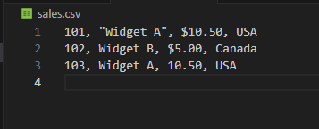
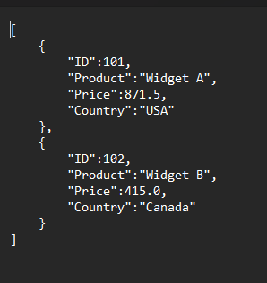

# Problem 2:The Sales Data Cleaner (Data Engineering ETL Project)

## 📌 Project Overview
This project demonstrates a simple ETL (Extract, Transform, Load) pipeline that cleans messy sales data from a CSV file and converts it into a structured JSON format.

The goal is to simulate a real-world data engineering task involving data cleaning, deduplication, and transformation.

---

## 📂 Input Data
The input file `sales.csv` contains raw sales records with issues such as:
- Dollar signs in price values
- Inconsistent quoting
- Duplicate product entries

---

## ⚙️ ETL Process

### 1. Extract
- Reads data from `sales.csv` using pandas.

### 2. Transform
- Removes `$` symbols and converts prices to float
- Cleans product names by removing quotes
- Removes duplicate records based on **Product** and **Price**
- Converts prices from USD to INR (1 USD = 83 INR)

### 3. Load
- Saves the cleaned data into `clean_sales.json`

---

## 🚀Set-Up Instructions: How to Run This Project (Step-by-Step)

Follow the steps below to set up and run the ETL pipeline locally.

---

### 1️⃣ Clone the Repository
Open your terminal (or VS Code terminal) and run:

1. git clone https://github.com/adityaraj-13/Zimetrics_Problem_2.git
2. cd Zimetrics

### 2️⃣ Create a Virtual Environment
- python -m venv venv

### 3️⃣ Activate the Virtual Environment
- On Windows: venv\Scripts\activate

- On macOS / Linux: source venv/bin/activate

### 4️⃣ Install Dependencies
- pip install -r requirements.txt

### 5️⃣ Run the ETL Script
- python etl_sales.py

---

## Logic :
### Why did I choose this approach?
- I used pandas because it is well-suited for ETL tasks like data cleaning, transformation, and deduplication.

- The ETL flow (Extract → Transform → Load) is clearly separated:

    - Extract: Read raw CSV data

    - Transform: Clean prices, remove quotes, deduplicate, convert currency

    - Load: Save the cleaned data into a JSON file

- This approach is scalable and easy to extend for larger datasets.

### What was the hardest bug you faced, and how did you fix it?

The hardest issue was handling inconsistent price formats in the dataset (some prices contained $ symbols while others were plain numbers).

Initially, price conversion failed because the Price column contained mixed string formats. While cleaning this, I also encountered a Python warning related to escape sequences when using regex to remove the $ symbol.

I resolved both issues by:

- Using a raw string (r'') for the regex pattern to correctly handle special characters

- Removing $ symbols and commas using regex-based replacement

- Converting the cleaned values safely to float

This ensured consistent numeric processing and eliminated both conversion errors and warnings.

---

## Output

### Input: Raw Sales Data (`sales.csv`)
This screenshot shows the original CSV file with inconsistent price formats and quoted product names.
---

--- 

### Output: Cleaned JSON Report (`clean_sales.json`)
This screenshot shows the final cleaned output after deduplication and currency conversion.
---

 
---

## Future Improvements
5️⃣ Future Improvements

If I had 2 more days, I would:

- Add basic data validation before processing: 
For example, checking for missing or non-numeric prices and skipping or flagging those rows instead of failing the entire pipeline.

- Modularize the ETL steps further: 
Splitting extract, transform, and load into separate functions would improve readability, testability, and maintainability.

- Replace print statements with Python’s logging module: 
This would allow configurable log levels (INFO, WARNING, ERROR) and make the pipeline easier to debug and production-ready without changing core logic.

- Add simple unit tests for transformation logic:
Using pytest to validate price cleaning, deduplication rules, and currency conversion to ensure correctness as the dataset grows.
